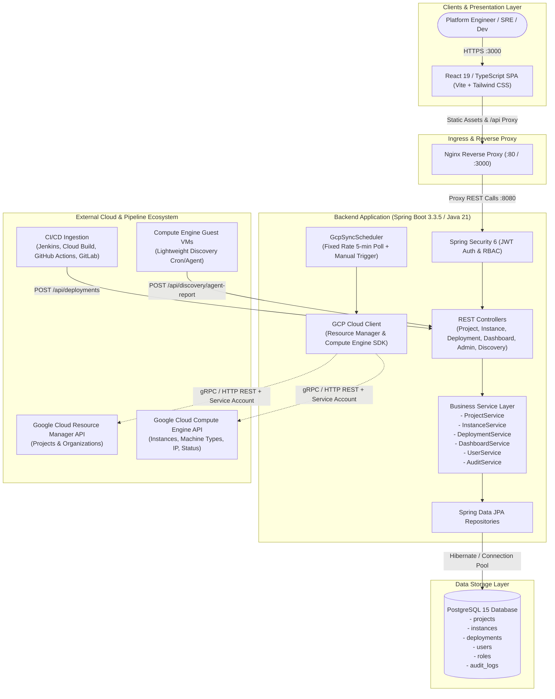
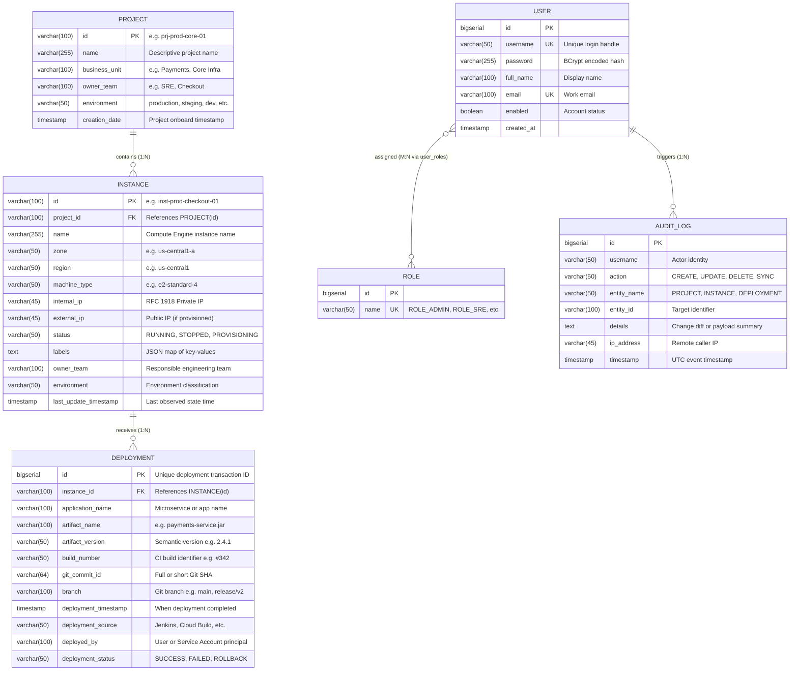

# VM & Artifact Inventory System — Enterprise Architecture & Design Document

## 1. System Overview & Problem Statement
Large cloud footprints across multi-tier organizations present critical visibility blindspots:
1. SRE and Platform teams lack immediate correlation between Google Cloud Compute Engine (VM) instances and the exact software artifacts/build versions deployed on them.
2. In the event of a critical security vulnerability (e.g., Log4Shell, CVE patching) or production outage, incident response teams struggle to identify which VMs run compromised versions.
3. Multi-project, multi-environment GCP setups suffer from configuration drift and untracked manual interventions.

The **VM & Artifact Inventory System** solves this by establishing a single pane of glass aggregating GCP Resource Manager, Compute Engine API, CI/CD deployment pipelines, and VM guest runtime agent reports into a centralized, immutable inventory database.

---

## 2. High-Level Architecture Diagram


---

## 3. Low-Level Component Design

### 3.1 Backend Architecture & Package Structure
```
backend/src/main/java/com/example/vminventory/
├── BackendApplication.java            # Spring Boot entry point with @EnableScheduling & @EnableAsync
├── config/
│   └── SecurityConfig.java            # Stateless JWT filter chain, password encoders, CORS policy
├── controller/
│   ├── AdminController.java           # RBAC user management, audit logs, on-demand GCP sync
│   ├── AuthController.java            # Login authentication & current user profile
│   ├── DashboardController.java       # Executive KPI metrics & 4 aggregated chart series
│   ├── DeploymentController.java      # CI/CD deployment history & ingestion webhooks
│   ├── InstanceController.java        # Compute Engine VM CRUD, multi-param search, CSV export
│   ├── MetadataDiscoveryController.java # Agent-based discovery ingestion & startup manifest endpoint
│   └── ProjectController.java         # GCP project management & filter metadata
├── dto/
│   ├── ApiResponse.java               # Standard immutable API response envelope
│   ├── PageResponse.java              # Standard paginated envelope with totalPages & totalElements
│   ├── ProjectDto.java / CreateProjectRequest.java
│   ├── InstanceDto.java / CreateInstanceRequest.java
│   ├── DeploymentDto.java / RecordDeploymentRequest.java
│   ├── DashboardSummaryDto.java / ChartDataPoint.java
│   ├── AuthRequest.java / AuthResponse.java / UserDto.java
│   ├── AuditLogDto.java
│   └── AgentDiscoveryReportRequest.java
├── gcp/
│   ├── GcpCloudClient.java            # Cloud discovery abstraction interface
│   ├── GoogleCloudClientImpl.java     # Live Google Cloud Java Client SDK implementation
│   └── MockGcpCloudClient.java        # High-fidelity mock cloud client for local/offline execution
├── model/
│   ├── AuditLog.java                  # Audit trail records (action, user, IP, timestamp, details)
│   ├── Deployment.java                # Immutable artifact deployment logs
│   ├── Instance.java                  # Compute Engine VM instance state & metadata
│   ├── Project.java                   # GCP Project representation
│   ├── Role.java                      # Security roles (ADMIN, SRE, DEVELOPER, VIEWER)
│   └── User.java                      # Security principals with BCrypt password hashes
├── repository/
│   ├── AuditLogRepository.java
│   ├── DeploymentRepository.java
│   ├── InstanceRepository.java
│   ├── ProjectRepository.java
│   └── UserRepository.java
├── scheduler/
│   └── GcpSyncScheduler.java          # Background thread pool periodic sync orchestrator
├── security/
│   ├── CustomUserDetailsService.java
│   ├── JwtAuthFilter.java             # Per-request Authorization header parser
│   └── JwtTokenProvider.java          # HMAC-SHA256 token issuance & cryptographic validation
├── seeder/
│   └── MockGcpDataSeeder.java         # Startup bootstrapper with realistic enterprise GCP fleet
└── service/
    ├── AuditService.java
    ├── DashboardService.java
    ├── DeploymentService.java
    ├── InstanceService.java
    ├── ProjectService.java
    └── UserService.java
```

---

## 4. Database Schema & Entity-Relationship (ER) Diagram



### Database Performance Optimization & Indexing
- `idx_instance_project_id`: B-Tree index on `instances(project_id)` for instant parent-child queries.
- `idx_instance_env_status`: Composite index on `instances(environment, status)` for dashboard aggregation.
- `idx_deployment_instance_time`: Composite index on `deployments(instance_id, deployment_timestamp DESC)` to resolve the latest active artifact on any VM in O(1) time.
- `idx_audit_timestamp`: B-Tree index on `audit_logs(timestamp DESC)` for paginated audit review.

---

## 5. Artifact Discovery Strategies

The system implements 3 distinct, complementary discovery mechanisms ensuring complete coverage:

### Option 1: Agent-Based Runtime Discovery
- **Mechanism**: A lightweight bash/python script or systemd timer running on the VM inspects local `/opt/app/manifest.json`, Spring Boot `build-info.properties`, or package manager registries.
- **Reporting**: Posts runtime facts directly to `POST /api/discovery/agent-report`.
- **Advantage**: Detects out-of-band updates, hotfixes, or manual package installations directly at the OS level.

### Option 2: Deployment Metadata Ingestion (CI/CD Webhook)
- **Mechanism**: CI/CD pipelines (Jenkins, Google Cloud Build, GitHub Actions) invoke `POST /api/deployments` immediately upon rolling out an artifact.
- **Payload**: Includes Git commit hash, build number, branch, pipeline initiator, and target VM instance ID.
- **Advantage**: Zero-latency recording of deployments with rich provenance and audit metadata.

### Option 3: Application Startup Manifest Discovery
- **Mechanism**: Standardized application endpoint (e.g. `/actuator/info` or `GET /api/discovery/manifest`).
- **Advantage**: Standardized, read-only self-describing introspection.

---

## 6. REST API Specification

All API responses follow the standard JSON envelope:
```json
{
  "success": true,
  "data": { ... },
  "message": "Operation completed successfully",
  "timestamp": "2026-09-06T00:10:00Z"
}
```

### 6.1 Authentication & Profile
- `POST /api/auth/login`
  - **Request**: `{"username": "admin", "password": "Password123!"}`
  - **Response**: Returns JWT token, expiration in seconds, and user roles.
- `GET /api/auth/me`
  - **Response**: Current authenticated user details and permissions.

### 6.2 Projects
- `GET /api/projects?search=prod&environment=production&page=0&size=10`
  - **Response**: Paginated list of GCP projects with real-time instance counts.
- `GET /api/projects/{id}`
  - **Response**: Individual project metadata and associated VM instances.
- `POST /api/projects` (Requires `ROLE_ADMIN` or `ROLE_SRE`)
  - **Request**: `{"id": "prj-analytics-01", "name": "BigData Analytics", "businessUnit": "Data", "ownerTeam": "DataEng", "environment": "production"}`
- `DELETE /api/projects/{id}` (Requires `ROLE_ADMIN`)

### 6.3 VM Instances
- `GET /api/instances?search=checkout&environment=production&status=RUNNING&page=0&size=10`
  - **Response**: Paginated list of VMs with latest active artifact version, Git commit, and deployment timestamp pre-resolved.
- `GET /api/instances/{id}`
  - **Response**: VM hardware specs, network IPs, GCP labels, and deployment history.
- `POST /api/instances` (Requires `ROLE_ADMIN` or `ROLE_SRE`)
- `GET /api/instances/export?search=&environment=`
  - **Response**: Formatted RFC 4180 CSV file stream for spreadsheet auditing.

### 6.4 Deployments
- `GET /api/deployments?page=0&size=20`
  - **Response**: Global chronological feed of all deployments across all clusters.
- `POST /api/deployments` (Requires `ROLE_ADMIN`, `ROLE_SRE`, or `ROLE_DEVELOPER`)
  - **Request**:
    ```json
    {
      "instanceId": "inst-prod-01",
      "applicationName": "payment-gateway",
      "artifactName": "payment-gateway.jar",
      "artifactVersion": "2.14.0",
      "buildNumber": "#841",
      "gitCommitId": "8f3b21c",
      "branch": "main",
      "deploymentSource": "Jenkins",
      "deployedBy": "jenkins-ci@enterprise.iam.gserviceaccount.com",
      "deploymentStatus": "SUCCESS"
    }
    ```

### 6.5 Executive Dashboard & Aggregations
- `GET /api/dashboard`
  - **Response**:
    - `totalProjects`, `totalInstances`, `runningInstances`, `stoppedInstances`, `devInstances`, `sreInstances`, `deploymentFailures`
    - `environmentDistribution`: Categorized breakdown (Production, Staging, QA, Dev, Sandbox, SRE-Tooling)
    - `instancesByProject`: Top projects by VM footprint
    - `artifactVersionDistribution`: Breakdown of active versions across the fleet
    - `deploymentTrends`: Daily velocity of successful vs failed deployments
    - `latestDeployments`: Top 5 most recent production releases

### 6.6 Discovery & Agent Reporting
- `POST /api/discovery/agent-report`
  - **Request**:
    ```json
    {
      "instanceName": "inst-prod-01",
      "projectId": "prj-prod-core-01",
      "zone": "us-central1-a",
      "internalIp": "10.128.0.12",
      "applicationName": "orders-service",
      "artifactName": "orders-service.jar",
      "artifactVersion": "3.1.0",
      "buildNumber": "#120",
      "gitCommitId": "4c9d1e2",
      "branch": "main",
      "installedPath": "/opt/app/orders-service.jar",
      "checksum": "sha256:4b9..."
    }
    ```

### 6.7 Administration & Audit
- `GET /api/admin/users`: List RBAC users and privileges.
- `PATCH /api/admin/users/{id}/role`: Elevate or modify user security role.
- `GET /api/admin/audit-logs`: Paginated security audit trail.
- `POST /api/admin/sync/trigger`: Trigger immediate manual background GCP synchronization.
- `GET /api/admin/sync/status`: Inspect scheduler execution stats and last sync runtime.

---

## 7. Role-Based Access Control (RBAC) Matrix

| Resource / Action | Admin | SRE | Developer | Viewer |
|:---|:---:|:---:|:---:|:---:|
| View Dashboard & Analytics | ✓ | ✓ | ✓ | ✓ |
| View Projects & Instances | ✓ | ✓ | ✓ | ✓ |
| Export Instances CSV | ✓ | ✓ | ✓ | ✓ |
| View Deployments & Audit Logs | ✓ | ✓ | ✓ | ✓ |
| Register Deployment (CI/CD) | ✓ | ✓ | ✓ | ✗ |
| Create / Update Project | ✓ | ✓ | ✗ | ✗ |
| Provision / Update VM Instance | ✓ | ✓ | ✗ | ✗ |
| Trigger Manual Cloud Sync | ✓ | ✓ | ✗ | ✗ |
| Delete Project / VM Instance | ✓ | ✗ | ✗ | ✗ |
| Manage User Roles & Privileges | ✓ | ✗ | ✗ | ✗ |

---

## 8. Reliability, Scalability & Production Readiness

1. **Scalability Considerations**:
   - Connection Pooling: HikariCP configured with 20 maximum connections, 30s connection timeout.
   - Server-Side Pagination: Mandatory `page` and `size` parameters on all entity listings prevent OOM errors even with 50,000+ VMs.
   - Batch Syncing: Periodic scheduler chunks GCP API requests across regions to respect GCP API quotas.
2. **Resilience & Circuit Breaking**:
   - Automatic fallback: If Google Cloud SDK credentials are not mounted in development or testing, the application gracefully switches to `MockGcpCloudClient` without startup failure.
3. **Observability**:
   - Spring Boot Actuator enabled on `/actuator/health`, `/actuator/info`, and `/actuator/metrics`.
   - Structured JSON logging with Correlation IDs (`MDC`) across HTTP requests.
